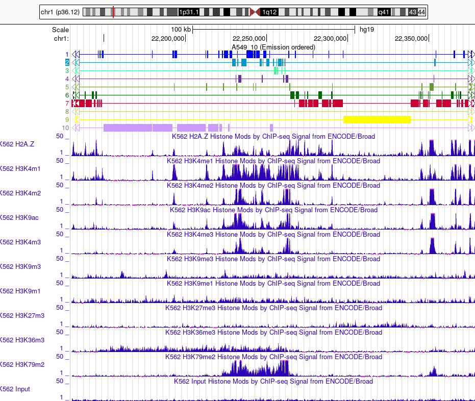

# hse_hw3_chromhmm
## Colab
[Ссылка на Colab](https://colab.research.google.com/drive/1IQP932OZE9tgE4FGZIPr1rw7EFuKfO2p?usp=sharing)
## Выборка данных
В работе анализируются гистоновые модификации клеточной линии K562

Гистоновая метка | Имя файла | Используемый файл
--- | --- | ---
H2AFZ | wgEncodeBroadHistoneK562H2azStdAlnRep1.bam | H2AFZ.bam
H3K27me3 | wgEncodeBroadHistoneK562H3k27me3StdAlnRep1.bam | H3K27me3.bam
H3K36me3 | wgEncodeBroadHistoneK562H3k36me3StdAlnRep1.bam | H3K36me3.bam
H3K4me1 | wgEncodeBroadHistoneK562H3k4me1StdAlnRep1.bam | H3K4me1.bam
H3K4me2 | wgEncodeBroadHistoneK562H3k4me2StdAlnRep1.bam | H3K4me2.bam
H3K4me3 | wgEncodeBroadHistoneK562H3k4me3StdAlnRep1.bam | H3K4me3.bam
H3K79me2 | wgEncodeBroadHistoneK562H3k79me2StdAlnRep1.bam | H3K79me2.bam
H3K9ac | wgEncodeBroadHistoneK562H3k9acStdAlnRep1.bam | H3K9ac.bam
H3K9me1 | wgEncodeBroadHistoneK562H3k9me1StdAlnRep1.bam | H3K9me1.bam
H3K9me3 | wgEncodeBroadHistoneK562H3k9me3StdAlnRep1.bam | H3K9me3.bam
Control | wgEncodeBroadHistoneK562ControlStdAlnRep1.bam | Control.bam
## HTML отчет CromHMM

Fold Enrichment overlap | Fold Enrichment TES neighborhood | Fold Enrichment TSS neighborhood | Emission Parameters | Transition parameters
--- | --- | --- | --- | ---
 |   |  |   | 

# Визуализация данных в UCSC Genome Browser

## Таблица состояний

Номер | Эпигенетический тип | Ассоциированные гистоновые метки | Свойства
--- | --- | --- | ---
1 | Strong enhancer | H3K4m1 | H3K4m1 [ассоциирован](https://doi.org/10.1186/s12864-017-4353-7) с энхансером
2 |  | H3K79m2 H3K4m1  |
3 |  | H3K79m2 |
4 | Active Promoter | H3K4m2 H3K4m3 H3K9ac H3K79m2 | H3K4me3, H3K9ac [ассоциированы](https://www.ncbi.nlm.nih.gov/pmc/articles/PMC3842134/) с активным хроматином/промотором
5 |  | H2AFZ H3K4m2 H3K4m3 H3K9ac |
6 |  | H2AFZ |
7 |  |  |
8 | Weak transcribed |  | Большой процент в геноме
9 |  |  |
10 |  |  |

